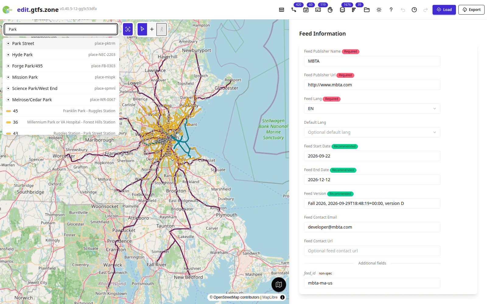
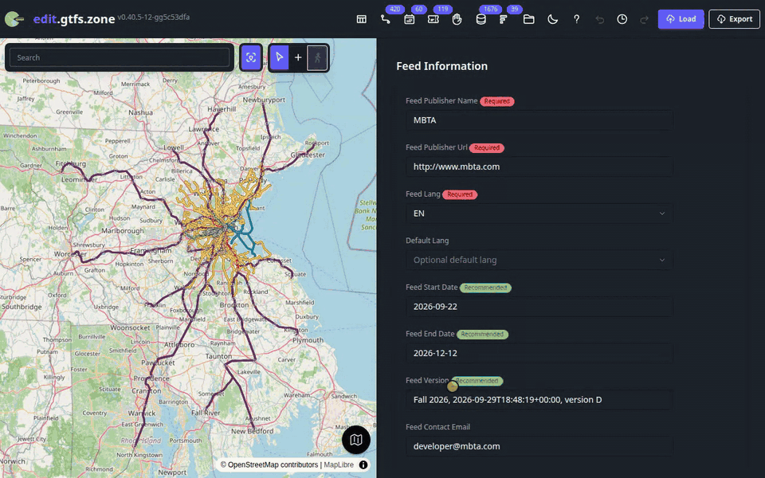

# GTFS.zone

[](https://github.com/gtfs-zone/gtfs-zone-editor/actions/workflows/check.yml?query=branch%3Amain) [](LICENSE.txt) [](https://edit.gtfs.zone)

A browser-based editor for GTFS (General Transit Feed Specification) transit
data, inspired by geojson.io. Load a feed from a ZIP or a URL, view it on a map,
edit it, and export it again. There is no login and no backend: all data stays
in the browser, in IndexedDB.

Live: [edit.gtfs.zone](https://edit.gtfs.zone)

## Screenshots

<picture>
  <source media="(prefers-color-scheme: dark)" srcset="docs/screenshots/dark/01-home-overview.png">
  
</picture>

The MBTA network on the map.

<picture>
  <source media="(prefers-color-scheme: dark)" srcset="docs/screenshots/dark/03-search-typing.png">
  
</picture>

Search across stops and routes.

<picture>
  <source media="(prefers-color-scheme: dark)" srcset="docs/screenshots/dark/05-route-red.png">
  
</picture>

A route page with its services and stop diagram.

<picture>
  <source media="(prefers-color-scheme: dark)" srcset="docs/screenshots/dark/10-stop-station.png">
  
</picture>

A station, with its pathways and nodes on the map.

<picture>
  <source media="(prefers-color-scheme: dark)" srcset="docs/screenshots/dark/12-stop-inline-edit.png">
  
</picture>

Editing a stop field in place.

<picture>
  <source media="(prefers-color-scheme: dark)" srcset="docs/screenshots/dark/15-pathway.png">
  
</picture>

A pathway between station nodes.

<picture>
  <source media="(prefers-color-scheme: dark)" srcset="docs/screenshots/dark/18-timetable-dense.png">
  
</picture>

A timetable with a trip every 10 minutes.

<picture>
  <source media="(prefers-color-scheme: dark)" srcset="docs/screenshots/dark/19-timetable-cr.png">
  
</picture>

A commuter rail timetable.

<picture>
  <source media="(prefers-color-scheme: dark)" srcset="docs/screenshots/dark/26-service-page.png">
  
</picture>

A service calendar with its weekly pattern and exceptions.

<picture>
  <source media="(prefers-color-scheme: dark)" srcset="docs/screenshots/dark/27-fares.png">
  
</picture>

Fares v2 tables.

<picture>
  <source media="(prefers-color-scheme: dark)" srcset="docs/screenshots/dark/31-feed-issues.png">
  
</picture>

Feed issues found on load.

<picture>
  <source media="(prefers-color-scheme: dark)" srcset="docs/screenshots/dark/32-history.png">
  
</picture>

Edit history, with undo and redo.

<picture>
  <source media="(prefers-color-scheme: dark)" srcset="docs/screenshots/dark/33-load-modal.png">
  
</picture>

Loading a feed from the feed catalogs.

<picture>
  <source media="(prefers-color-scheme: dark)" srcset="docs/screenshots/dark/37-basemap-satellite.png">
  
</picture>

The satellite basemap.

<picture>
  <source media="(prefers-color-scheme: dark)" srcset="docs/screenshots/dark/39-zone-page.png">
  
</picture>

An on-demand zone.


A route page on a phone.



Searching for a route.


From a route to a station to a platform.


Adding a stop on the map.


Adding weekend days to a service.


Editing a zone's geometry.

Map data OpenStreetMap contributors. Satellite imagery Esri. Transit data MBTA.
## Quick start

```bash
pnpm install
pnpm dev      # dev server on http://localhost:8080
pnpm build    # production build into dist/
```

## Stack

- TypeScript
- MapLibre GL
- Vite
- Tailwind CSS v4 + DaisyUI 5
- IndexedDB (via `idb`)
- Zod
- [gtfs-zone-web-common](https://github.com/gtfs-zone/gtfs-zone-web-common), the UI, map and
  GTFS modules shared with the other gtfs.zone apps

## GTFS support

Not every GTFS Schedule file has a dedicated view. See
[docs/gtfs-implementation-status.md](docs/gtfs-implementation-status.md) for
which files have their own editor and which are only in the table viewer.

## Contributing

See [CONTRIBUTING.md](CONTRIBUTING.md). Bugs and feature requests go to the
[issue tracker](https://github.com/gtfs-zone/gtfs-zone-editor/issues).

## Security

See [SECURITY.md](SECURITY.md) for how to report a vulnerability.

## License

GNU Affero General Public License v3.0 or later (`AGPL-3.0-or-later`), see
[LICENSE.txt](LICENSE.txt). Per-file licensing is declared in
[REUSE.toml](REUSE.toml), with the license texts in [LICENSES/](LICENSES/).

### Third-party content

`reference/gtfs-reference.md`, `src/gtfs-spec/files/` and
`src/assets/gtfs-spec/` are derived from the
[GTFS Schedule reference](https://github.com/google/transit), Copyright Google
Inc. and contributors (maintained by MobilityData), licensed under the
[Apache License 2.0](LICENSES/Apache-2.0.txt).

## Links

- [GTFS Schedule reference](https://gtfs.org/documentation/schedule/reference/)
- [Issue tracker](https://github.com/gtfs-zone/gtfs-zone-editor/issues)
